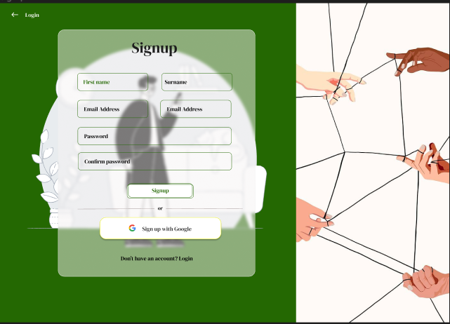
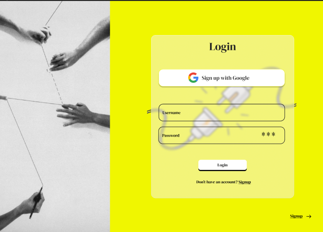
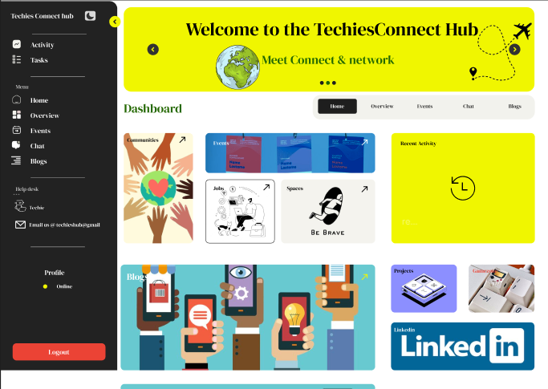

# TechiesConnect

Welcome to TechiesConnect, a social hub for students to interact globally, read and create blogs, join communities, attend mastercamps, and access learning materials. This project is built using the MERN stack (MongoDB, Express.js, React.js, Node.js) and is developed by Kevin Mbugua Kiarie and Ronney Otieno.

## Table of Contents

1. [Introduction](#introduction)
2. [Features](#features)
3. [Technologies Used](#technologies-used)
4. [Getting Started](#getting-started)
5. [Usage](#usage)
6. [Contributing](#contributing)
7. [License](#license)
8. [Prototype](#Prototype)

## Introduction

TechiesConnect is a platform designed to bring students from around the country and even globally together in a collaborative and educational environment. Whether you're looking to connect with peers, share knowledge through blogs, participate in communities, or enhance your skills through mastercamps and learning materials, TechiesConnect has something for everyone.

## Features

- **User Profiles**: Create personalized profiles to showcase skills, projects, and interests.
- **Discussion Forums**: Engage in discussions on various tech topics and connect with peers.
- **Event Calendar**: Stay updated on tech-related events, workshops, and networking opportunities.
- **Job Board**: Explore internship, co-op, and job opportunities from leading tech companies.
- **Learning Resources/Blogs**: Access curated tutorials, articles, and online courses on tech topics.
- **Mentorship Program**: Connect with mentors for guidance and support on career development.
- **Global Interaction**: Connect with students from all over the world and engage in meaningful discussions.
- **Blogging Platform**: Read and create blogs on various topics related to technology, education, and more.
- **Community Joining**: Join communities based on your interests, courses, or career goals.
- **Mastercamps**: Attend virtual mastercamps conducted by industry experts to enhance your skills.
- **Learning Materials**: Access a library of learning materials, including tutorials, articles, and videos.

## Technologies Used

- **Frontend**: React.js
- **Backend**: Node.js, Express.js
- **Database**: MongoDB
- **Authentication**: JSON Web Tokens (JWT)
- **Deployment**: Heroku (Backend), Netlify (Frontend)

## Getting Started

To get started with TechiesConnect locally, follow these steps:

1. Clone the repository: `git clone https://github.com/0tieno/techiesConnectPlatform
`
2. Navigate to the project directory: `cd techies-connect`
3. Install dependencies: `npm install`
4. Start the development server: `npm start`
5. Access the application in your web browser at `http://localhost:3000`

## Usage

- Once the application is running locally or deployed, sign up for an account or log in if you already have one.
- Explore the platform, join communities, read blogs, and participate in discussions.
- Create your own blogs, join mastercamps,engage in the Job board,stay updated on tech events and access learning materials to enhance your skills.
- Connect with other students, share knowledge, and collaborate on projects.

## Contributing

We welcome contributions from the community to improve and expand TechiesConnect. If you'd like to contribute, please follow these steps:

1. Fork the repository.
2. Create a new branch for your feature or bug fix: `git checkout -b feature-name`
3. Make your changes and commit them: `git commit -m "Brief description of your changes"`
4. Push your changes to your fork: `git push origin feature-name`
5. Create a pull request with a detailed description of your changes.

## License

This project is licensed under the MIT License.

<<<<<<< HEAD:documentation/README.md

## Prototype

<iframe width="800" height="450" src="[YOUR_FIGMA_SHAREABLE_LINK](https://www.figma.com/proto/AYDYVfXzDfok1G4DXiniKw/TechiesConnect?page-id=103%3A2&type=design&node-id=106-605&viewport=622%2C-1937%2C1.34&t=TMAudsKGndZ8RSqY-1&scaling=min-zoom&mode=design)https://www.figma.com/proto/AYDYVfXzDfok1G4DXiniKw/TechiesConnect?page-id=103%3A2&type=design&node-id=106-605&viewport=622%2C-1937%2C1.34&t=TMAudsKGndZ8RSqY-1&scaling=min-zoom&mode=design" frameborder="0" allowfullscreen></iframe>

()
()
()
()

=======

> > > > > > > 8694cd977174b3b1f480a97ada298d3a5b7c2be9:README.md
